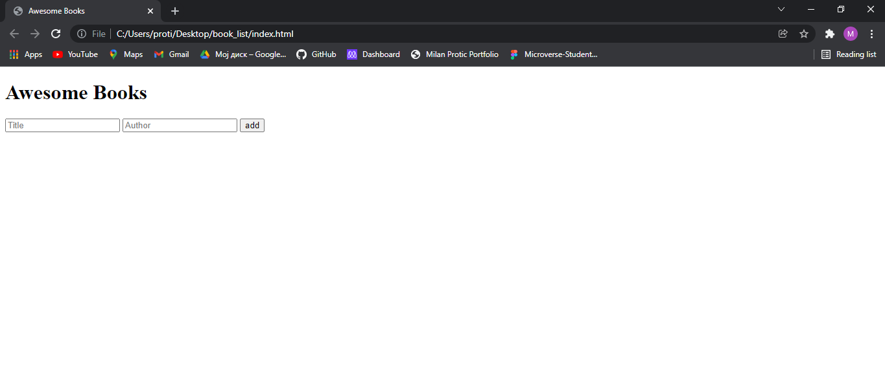

# Awesome Books

> Creating an app that adds and delete books from a list.

## Built With

- HTML
- CSS
- JavaScript

## Application Page url

https://TimmyChan99.github.io/book_list/

## Getting Started

> To get a local copy follow the following steps:

- Copy this link https://github.com/TimmyChan99/book_list.git
- Open your terminal or command line
- Run git clone and paste the link
- Open the folder with your code editor
- Create a branch to work on

## Authors

👤 **Author 1**

- GitHub: [@TimmyChan99](https://github.com/TimmyChan99)

👤 **Author 2**

- GitHub: [@zieeco](https://github.com/zieeco)

 👤**Author 3**

- GitHub: [@tresorsawasawa](https://github.com/tresorsawasawa)

## 🤝 Contributing

Contributions, issues, and feature requests are welcome!

Feel free to check the [issues page](../../issues/).

## Show your support

Give a ⭐️ if you like this project!

## Acknowledgments

- Hat tip to anyone whose code was used
- Inspiration
- etc

## 📝 License

This project is [MIT](./MIT.md) licensed.
